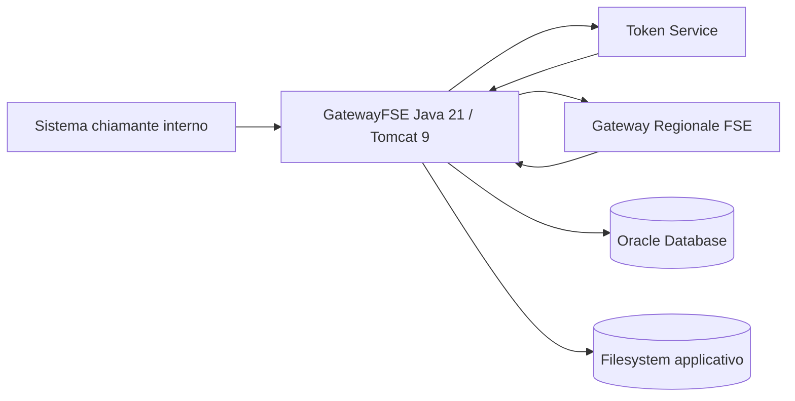
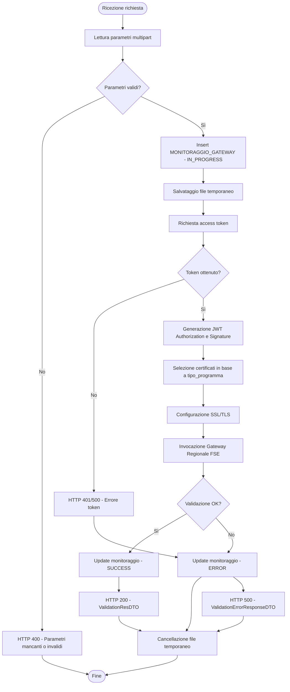
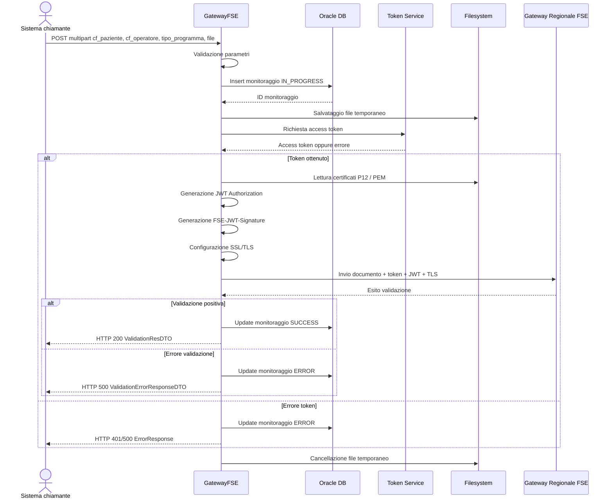
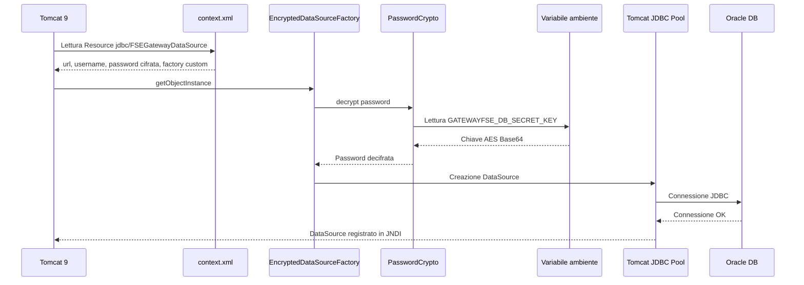

# GatewayFSE


Sistema per la validazione documentale tramite Gateway Regionale FSE.

---

## 📌 Descrizione

**GatewayFSE** è un’applicazione Java deployata su **Apache Tomcat 9** in ambiente **Windows Server 2022**, sviluppata per integrare i sistemi interni con il servizio esterno del **Gateway Regionale FSE**.

Il sistema riceve in input un documento e i relativi dati applicativi, genera i token JWT richiesti dal Gateway, configura il canale TLS tramite certificati applicativi e invoca il servizio esterno di validazione.

La richiesta applicativa contiene:

- codice fiscale del paziente
- codice fiscale dell’operatore
- tipo programma
- documento da validare

Il codice fiscale del paziente e il codice fiscale dell’operatore sono utilizzati per la generazione dei JWT da presentare al Gateway FSE.

Il parametro `tipo_programma` viene utilizzato per selezionare i certificati e i parametri applicativi corretti da utilizzare nella generazione dei token e nella comunicazione con il servizio esterno.

Il sistema prevede inoltre:

- richiesta access token tramite servizio esterno
- generazione JWT Authorization e FSE-JWT-Signature
- invocazione del servizio di validazione documentale
- logging applicativo
- monitoraggio delle richieste su database Oracle
- gestione sicura della password del DataSource tramite cifratura

---

## 🏗️ Architettura

Il sistema è composto dai seguenti componenti:

- **GatewayFSE Web Application**  
  Applicazione Java 21 deployata su Apache Tomcat 9.

- **Servlet DocumentsValidation**  
  Endpoint principale che riceve la richiesta multipart e coordina il processo di validazione.

- **Token Service**  
  Servizio esterno utilizzato per ottenere l’access token.

- **Gateway Regionale FSE**  
  Servizio esterno invocato per la validazione del documento.

- **Database Oracle**  
  Utilizzato per logging e monitoraggio delle richieste.

- **Filesystem applicativo**  
  Utilizzato per configurazioni, certificati, log e file temporanei.

- **DataSource JNDI Tomcat**  
  Risorsa configurata nel context Tomcat per l’accesso al database Oracle.

---

## 📊 Schema logico



---

## 🔄 Flusso operativo

1. Ricezione richiesta multipart contenente documento e parametri.
2. Lettura dei parametri:
   - `cf_paziente`
   - `cf_operatore`
   - `tipo_programma`
   - `file`
3. Validazione dei parametri obbligatori.
4. Inserimento record iniziale su database con stato `IN_PROGRESS`.
5. Salvataggio temporaneo del file ricevuto.
6. Richiesta access token al servizio configurato.
7. Generazione JWT Authorization e FSE-JWT-Signature.
8. Selezione certificati in base al tipo programma.
9. Configurazione contesto TLS.
10. Invocazione del Gateway Regionale FSE.
11. Gestione risposta positiva o errore.
12. Aggiornamento monitoraggio su database.
13. Cancellazione file temporaneo.
14. Restituzione risposta JSON al chiamante.

---

## 📊 Diagramma di flusso



---

## 📊 Sequenza logica



---

## 🌐 API

### Endpoint validazione documento

| Metodo | Endpoint | Descrizione |
|---|---|---|
| POST | `/GatewayFSE/[servlet]` | Validazione documento tramite Gateway Regionale FSE |
| GET | `/GatewayFSE/[servlet]` | Invocazione dello stesso processo, se prevista dal mapping servlet |

Il mapping effettivo dipende dalla configurazione della servlet nel progetto.

---

### Parametri richiesta

La richiesta deve essere di tipo:

```text
multipart/form-data
```

| Parametro | Tipo | Obbligatorio | Descrizione |
|---|---|---|---|
| `cf_paziente` | string | Sì | Codice fiscale del paziente |
| `cf_operatore` | string | Sì | Codice fiscale dell’operatore |
| `tipo_programma` | string | Sì | Tipo programma utilizzato per selezionare certificati e configurazione JWT |
| `file` | file | Sì | Documento da validare |

---

### Esempio richiesta

```bash
curl -X POST "http://SERVER:PORT/GatewayFSE/DocumentsValidation" \
  -F "cf_paziente=RSSMRA80A01H501U" \
  -F "cf_operatore=BNCLGU80A01H501X" \
  -F "tipo_programma=CERT_VACC" \
  -F "file=@documento.pdf"
```

---

## 📤 Risposte

### Risposta positiva

```json
{
  "traceID": "string",
  "spanID": "string",
  "workflowInstanceId": "string",
  "warning": "string"
}
```

---

### Risposta errore Gateway

```json
{
  "traceID": "string",
  "spanID": "string",
  "type": "string",
  "title": "string",
  "detail": "string",
  "status": 500,
  "instance": "string",
  "workflowInstanceId": "string",
  "govway_id": "string"
}
```

---

### Risposta errore applicativo

```json
{
  "errorCode": 500,
  "errorMessage": "Descrizione errore"
}
```

---

## ⚙️ Configurazione

La configurazione del sistema è gestita tramite file e configurazioni esterne:

- `config.properties` → configurazione applicativa
- `context.xml` → configurazione DataSource JNDI Tomcat
- variabile d’ambiente `GATEWAYFSE_DB_SECRET_KEY` → chiave per decifrare la password DB
- certificati `.p12` / `.pem` → firma JWT e comunicazione TLS

---

### Parametri principali `config.properties`

```properties
# Endpoint servizi esterni
token.url=https://TOKEN_SERVICE_URL
authorization.header=Basic BASE64_CLIENT_CREDENTIALS
url.validation=https://GATEWAY_REGIONALE_URL

# Logging
log.path=C:/temp/GatewayFSE/logs
debug.mode=false

# TLS
path.FileP12=/WEB-INF/certificati/certificato.p12
ssl.keystore.password=PASSWORD_KEYSTORE

# Certificati per programma
pem.CERT_VACC=/WEB-INF/certificati/cert_vacc.pem
p12.CERT_VACC=/WEB-INF/certificati/cert_vacc.p12

pem.SING_VACC=/WEB-INF/certificati/sing_vacc.pem
p12.SING_VACC=/WEB-INF/certificati/sing_vacc.p12

pem.LDO=/WEB-INF/certificati/ldo.pem
p12.LDO=/WEB-INF/certificati/ldo.p12
```

---

### Context Tomcat

Esempio di configurazione del DataSource JNDI:

```xml
<?xml version="1.0" encoding="UTF-8"?>

<Context path="/GatewayFSE">

    <Resource name="jdbc/FSEGatewayDataSource"
              auth="Container"
              type="javax.sql.DataSource"
              factory="com.mycompany.gatewayfse.EncryptedDataSourceFactory"
              driverClassName="oracle.jdbc.OracleDriver"
              url="jdbc:oracle:thin:@//HOST_DB:PORT/SERVICE_NAME"
              username="DB_USERNAME"
              password="ENC(PASSWORD_CIFRATA)"
              maxActive="10"
              initialSize="5"
              validationQuery="SELECT 1 FROM DUAL"
              testOnBorrow="true"
              useJmx="false"/>

</Context>
```

---

## 🔐 Sicurezza

Il sistema adotta le seguenti misure:

- comunicazione verso Gateway FSE tramite HTTPS/TLS
- utilizzo di certificati applicativi P12/PEM
- generazione dinamica di JWT firmati
- accesso database tramite DataSource JNDI Tomcat
- password database cifrata nel context Tomcat
- chiave AES gestita tramite variabile d’ambiente
- assenza di password database in chiaro nel codice sorgente
- logging senza esposizione di password, chiavi private o token
- cancellazione dei file temporanei al termine della richiesta
- configurazioni reali e certificati esclusi dal repository Git

---

## 🔑 Gestione password database cifrata

La password del database viene cifrata e inserita nel `context.xml` nel formato:

```xml
password="ENC(PASSWORD_CIFRATA)"
```

La chiave di decifratura viene letta dalla variabile d’ambiente:

```text
GATEWAYFSE_DB_SECRET_KEY
```

Esempio configurazione Windows Server:

```bat
setx GATEWAYFSE_DB_SECRET_KEY "CHIAVE_AES_BASE64" /M
```

Dopo la modifica della variabile d’ambiente è necessario riavviare il servizio Tomcat.

---

## 📊 DataSource cifrato



---

## 📊 Stati monitoraggio

```bash
IN_PROGRESS → SUCCESS
IN_PROGRESS → ERROR
```

### Descrizione stati

| Stato | Descrizione |
|---|---|
| `IN_PROGRESS` | Richiesta ricevuta e processo avviato |
| `SUCCESS` | Validazione completata con esito positivo |
| `ERROR` | Errore applicativo, errore token o errore restituito dal Gateway |

---

## 📊 Logging

Il sistema prevede diversi livelli di logging:

- **Log applicativo su file**
- **Log su database**
- **Monitoraggio richiesta su tabella dedicata**

### Caratteristiche

- log giornalieri
- directory configurabile
- livello log configurabile tramite `debug.mode`
- tracciamento inizio/fine richiesta
- registrazione esiti Gateway
- supporto al troubleshooting
- registrazione traceID e workflowInstanceId restituiti dal Gateway

---

## 🗄️ Database

Il sistema utilizza Oracle Database per:

- registrazione log applicativi
- monitoraggio delle richieste
- tracciamento esito della validazione
- salvataggio dati tecnici restituiti dal Gateway

### Tabelle principali

| Tabella | Descrizione |
|---|---|
| `LOG_TABLE` | Log applicativi |
| `MONITORAGGIO_GATEWAY` | Monitoraggio richieste verso Gateway FSE |

---

## 📦 SBOM

Il sistema può supportare la generazione di SBOM tramite **Syft**.

### Generazione SBOM

```bash
syft . -o cyclonedx-json > sbom.json
```

### Analisi vulnerabilità

```bash
grype sbom:sbom.json
```

---

## 🚀 Deploy

### Requisiti

- Windows Server 2022
- Java 21
- Apache Tomcat 9
- Maven
- Oracle Database
- Oracle JDBC Driver
- accesso rete verso:
  - Token Service
  - Gateway Regionale FSE
  - Oracle DB

---

### Build

```bash
mvn clean package
```

Output atteso:

```text
target/GatewayFSE.war
```

---

### Installazione

1. Generare il file `.war` tramite Maven.
2. Arrestare il servizio Tomcat.
3. Copiare il WAR in:

```text
<TOMCAT_HOME>\webapps\
```

4. Configurare il context Tomcat per il DataSource JNDI.
5. Configurare `config.properties`.
6. Copiare i certificati `.p12` e `.pem` nelle directory previste.
7. Configurare la variabile d’ambiente `GATEWAYFSE_DB_SECRET_KEY`.
8. Avviare Tomcat.
9. Verificare i log applicativi.
10. Eseguire una richiesta di test.

---

### Riavvio Tomcat

```bat
net stop Tomcat9-CT
net start Tomcat9-CT
```

Il nome del servizio può variare in base all’installazione.

---

## 🧪 Test

### Test multipart

```bash
curl -X POST "http://SERVER:PORT/GatewayFSE/DocumentsValidation" \
  -F "cf_paziente=RSSMRA80A01H501U" \
  -F "cf_operatore=BNCLGU80A01H501X" \
  -F "tipo_programma=CERT_VACC" \
  -F "file=@documento.pdf"
```

---

## 🛠️ Tecnologie

- Java 21
- Maven
- Apache Tomcat 9
- Oracle Database
- Oracle JDBC
- JNDI DataSource
- JWT RS256
- TLS / SSLContext
- PKCS#12 / PEM
- Jackson
- OkHttp
- BouncyCastle
- Swagger / OpenAPI
- Windows Server 2022

---

## 📌 Note operative

- La password del database non deve essere inserita in chiaro nel repository.
- La chiave AES non deve essere inclusa nel codice sorgente.
- I certificati reali non devono essere committati.
- I JWT e gli access token non devono essere scritti nei log.
- Dopo ogni modifica a variabili d’ambiente o context Tomcat è necessario riavviare Tomcat.
- Il parametro `tipo_programma` deve corrispondere a uno dei programmi gestiti dall’applicazione.